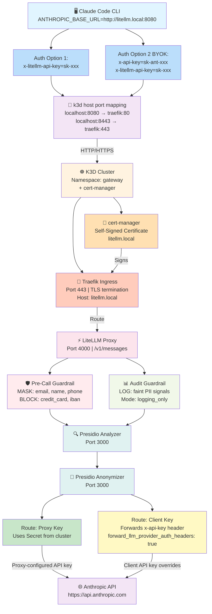

# PII-Guardian — PII-Aware AI Gateway for Claude Code

[](LICENSE)
[]()

> **Not intended for production use.** This is a local proof-of-concept built for portfolio and learning purposes. It uses self-signed certificates, a single-replica cluster, no persistent storage, and hardcoded demo credentials. Do not expose it to a network or use it to process real personal data.

A local POC that validates a GDPR defense-in-depth architecture: PII is detected, masked, and
selectively blocked by a LiteLLM + Microsoft Presidio gateway **before prompts leave your perimeter**.

---

## Quick Start

```bash
# 1. Prerequisites: Docker, k3d ≥ v5.6, kubectl ≥ v1.28, task ≥ v3.30, jq, Claude Code CLI ≥ v2.1.129

# 2. Configure your Anthropic API key
cp .env.example .env
# Edit .env and set ANTHROPIC_API_KEY=sk-ant-...

# 3. Pin image digests (one-time — commit the resulting git diff after review)
task pin-images

# 4. Run the demo
task demo
```

The demo brings up a local K3D cluster, routes Claude Code through a LiteLLM + Presidio gateway,
and walks through three scenarios proving **MASK**, **AUDIT**, and **BLOCK** behaviors.

---

## Supply Chain

> **WARNING — NEVER run `pip install litellm` for any reason, including local development.**
>
> LiteLLM PyPI versions **1.82.7 and 1.82.8 contained credential-stealing malware**
> (documented by Anthropic). This project uses the official container image only:
> `ghcr.io/berriai/litellm:main-stable`, pinned to a specific SHA-256 digest.
>
> The `task pin-images` command pins digests. The `task verify-images` step (which `task up`
> depends on) fails hard if any image in the manifests lacks a `@sha256:` pin.
> **Review the `git diff manifests/` output before committing pinned digests.**

---

## Operator Prerequisites

- macOS or Linux
- Docker Desktop or Podman 4.x with Docker socket emulation
- `k3d` ≥ v5.6
- `kubectl` ≥ v1.28
- `task` (Taskfile.dev) ≥ v3.30
- `jq`
- Claude Code CLI ≥ v2.1.129
- An Anthropic API key with access to Claude models (set in `.env` as `ANTHROPIC_API_KEY`)
- Network access to `api.anthropic.com`

The API key is consumed by LiteLLM to authenticate outbound requests. Developers' Claude Code
subscriptions are separate and are not used by the gateway. See §14 of the spec for production
authentication options (including the subscription-only path).

---

## Task Reference

| Command | Description |
|---------|-------------|
| `task pin-images` | Pull images and write SHA-256 digests into manifests (run once) |
| `task up` | Create K3D cluster, apply manifests, wait for Ready |
| `task demo` | Full demo — MASK, AUDIT, BLOCK scenarios |
| `task down` | Stop the cluster (preserves state) |
| `task clean` | Delete the cluster entirely |
| `task verify-images` | Re-pull and verify digests match manifests |
| `task status` | Pod status + last 20 log lines + health check |
| `task logs` | Follow LiteLLM logs |
| `task reload-config` | Re-apply LiteLLM config and rolling-restart (zero downtime) |

---

**Status:** Implemented
**Reference docs:**
- Claude Code Network Configuration
- Claude Code LLM Gateway
- LiteLLM Presidio Guardrail
- LiteLLM Guardrails on Pass-Through Endpoints

---

## 1. Context
Acme Inc. operates Claude Enterprise with several hundred developer subscriptions. The Enterprise DPA and EU SCCs provide the legal framework for personal-data transfers to Anthropic's US-based infrastructure. To strengthen the GDPR posture with a *defense-in-depth* technical control, Acme wants to introduce a centralized AI gateway that detects, masks, and selectively blocks PII before prompts leave the perimeter.
This POC validates the architecture locally on **K3D** before any consideration of production cluster rollout. The headline deliverable is a task demo that executes against the real Anthropic API via an authenticated Claude Code CLI.

## 2. Goal
A single task demo command that:
1. Brings up a local K3D cluster with LiteLLM + Presidio (analyzer + anonymizer)
2. Configures the operator's Claude Code CLI to route through the local gateway via ANTHROPIC_BASE_URL
3. Executes three scenarios proving **MASK**, **AUDIT**, and **BLOCK** behaviors
4. Displays clear evidence (LiteLLM logs, before/after prompt bodies) that the protection layer worked
The POC must be reproducible and tear-downable with task clean.

## 3. Non-Goals (what Claude Code must NOT do)
Stay tight on scope. Do **not**:
- Fork or vendor third-party MITM proxies; do not write a custom MITM proxy.
- Add Langfuse, Datadog, OpenTelemetry, or any observability backend. kubectl logs is sufficient.
- Add Helm charts, ArgoCD, Flux, or GitOps tooling. Use plain kubectl apply invoked from Taskfile.
- Add Istio, Linkerd, or any service mesh.
- Add Postgres, Redis, or persistent volumes. Everything is ephemeral.
- Write custom Python guardrails. Use LiteLLM's built-in presidio guardrail only.
- Implement a mock Anthropic endpoint. The demo hits the real Anthropic API.
- Add French (fr) or other non-English Presidio support. English-only.
- Add custom recognizers (national ID schemes, customer-specific IDs). Use Presidio defaults.
- **Install LiteLLM via pip install litellm.** See section 13 — only the official container image is acceptable.

## 4. Architecture

The integration follows the officially documented LLM gateway pattern: Claude Code is pointed at LiteLLM via ANTHROPIC_BASE_URL, authenticates to LiteLLM via ANTHROPIC_AUTH_TOKEN, and LiteLLM forwards to Anthropic using its own configured API key.



### Authentication Modes

The diagram shows two auth paths supported by `forward_llm_provider_auth_headers`:

| Mode | Use Case | Header | How It Works |
|------|----------|--------|--------------|
| **Proxy Mode** (POC default) | Centralized auth, shared costs | `x-litellm-api-key=sk-poc-...` | LiteLLM uses its Kubernetes Secret API key; client auth is just to unlock the proxy. |
| **BYOK** (Bring Your Own Key) | Client pays directly, audit per-developer | `x-api-key=sk-ant-...`<br/>`x-litellm-api-key=sk-poc-...` | LiteLLM forwards the client's API key to Anthropic, overriding the proxy key. |

### Why This Matters

- **POC (this project):** Uses Proxy Mode — one shared API key from the Kubernetes Secret. Simpler for demo. Cost is centralized.
- **Production BYOK:** When enabled (`forward_llm_provider_auth_headers: true`), each developer uses their own subscription/API key. LiteLLM still provides PII masking, audit logging, and per-session attribution — but billing is per-developer. This satisfies the "subscription-only" constraint.

**Why this pattern over HTTPS_PROXY:** the LLM-gateway pattern is documented and supported by Anthropic, requires no TLS interception, no CA distribution, and no MITM. The guardrails see the request body as structured JSON, not bytes to demangle from a TLS tunnel.

### TLS & cert-manager

The POC now includes **production-grade TLS termination** using cert-manager and self-signed certificates:

- **cert-manager** automatically installs and manages certificates in Kubernetes
- **Traefik ingress controller** terminates TLS at port 443
- **Self-signed issuer** provisions certificates for `litellm.local` (automatically in K3D)

**For local development** (no port-forward needed):
```bash
# k3d maps host ports directly via the built-in loadbalancer
export ANTHROPIC_BASE_URL=http://litellm.local:8080   # HTTP — no cert needed
# or HTTPS (self-signed, use -k with curl):
export ANTHROPIC_BASE_URL=https://litellm.local:8443
export ANTHROPIC_AUTH_TOKEN=sk-xxx
```

The host port mapping (`8080:80`, `8443:443`) is declared in `k3d/cluster.yaml`. A `HelmChartConfig` (`manifests/15-traefik-config.yaml`) configures Traefik to bind `hostPort: 80/443` on the server node, so traffic reaches Traefik without any port-forward. Add `127.0.0.1 litellm.local` to `/etc/hosts` (already present if you've run `task up`).

In production, replace the `ClusterIssuer: selfsigned` with Let's Encrypt or your organization's CA.

## 5. Repository Structure

pii-guardian/
├── README.md
├── Taskfile.yml
├── .env.example                        # template for ANTHROPIC_API_KEY
├── k3d/
│   └── cluster.yaml
├── manifests/
│   ├── 00-namespace.yaml
│   ├── 10-presidio-analyzer.yaml
│   ├── 11-presidio-anonymizer.yaml
│   ├── 21-litellm-config.yaml         # ConfigMap with guardrail YAML
│   ├── 22-litellm.yaml                # Deployment + Service
│   ├── 15-traefik-config.yaml         # HelmChartConfig — hostPort 80/443 for k3d
│   ├── 25-certificate-issuer.yaml     # cert-manager ClusterIssuer + Certificate
│   └── 26-litellm-ingress.yaml        # Traefik Ingress (HTTPS + HTTP)
├── demo/
│   ├── scenario-mask.sh
│   ├── scenario-audit.sh
│   ├── scenario-block.sh
│   └── show-evidence.sh
└── docs/
    └── notes.md

## 6. Component Specifications
### 6.1 K3D Cluster
- Single-node cluster named claude-gateway-poc
- K3s version: latest stable (pin in k3d/cluster.yaml)
- **Traefik enabled** (default; used for ingress — HTTP port 8080, HTTPS port 8443)
- ServiceLB (Klipper) disabled — the Kubernetes-level IP allocator for LoadBalancer Services is not needed here
- Host connectivity via k3d's nginx sidecar container, which maps `localhost:8080→node:80` and `localhost:8443→node:443` at the Docker layer (declared in `k3d/cluster.yaml`)
- Traefik configured via `HelmChartConfig` to bind `hostPort: 80/443` on the server node so the nginx sidecar can reach it
### 6.2 Presidio Analyzer
- Image: mcr.microsoft.com/presidio-analyzer (pin to a specific tag and digest at scaffolding time)
- Replicas: 1
- Resources: requests 500m CPU / 1Gi memory; limits 1 CPU / 2Gi memory
- ClusterIP service, port 3000
- Liveness/readiness on /health
- Bundled English spaCy model — no init container
### 6.3 Presidio Anonymizer
- Image: mcr.microsoft.com/presidio-anonymizer (pin to a specific tag and digest at scaffolding time)
- Replicas: 1
- Resources: requests 100m CPU / 128Mi memory; limits 200m CPU / 256Mi memory
- ClusterIP service, port 3000
- Liveness/readiness on /health
### 6.4 LiteLLM
**Image source is non-negotiable:** use ghcr.io/berriai/litellm:main-stable only, pinned to a specific image digest at scaffolding time. **Never** install via PyPI. See section 13 for the supply-chain rationale.
- Replicas: 1
- Config mounted from ConfigMap to /app/config.yaml
- Service: ClusterIP, port 4000
- Required env (from Secret litellm-secrets):
  - ANTHROPIC_API_KEY — Anthropic API key used by LiteLLM to call Anthropic
  - LITELLM_MASTER_KEY — proxy key; the value Claude Code sends as ANTHROPIC_AUTH_TOKEN (see .env)
- Required env (from ConfigMap or inline):
  - PRESIDIO_ANALYZER_API_BASE=http://presidio-analyzer.gateway.svc.cluster.local:3000
  - PRESIDIO_ANONYMIZER_API_BASE=http://presidio-anonymizer.gateway.svc.cluster.local:3000
  - LITELLM_LOG=DEBUG
- Args: ["--config", "/app/config.yaml", "--port", "4000", "--detailed_debug"]
### 6.5 LiteLLM Configuration
The ConfigMap litellm-config contains config.yaml:

model_list:
  - model_name: "claude-*"
    litellm_params:
      model: "anthropic/*"
      api_key: "os.environ/ANTHROPIC_API_KEY"
general_settings:
  master_key: "os.environ/LITELLM_MASTER_KEY"
guardrails:
  # Primary protective layer — masks visible PII, blocks financial data
  - guardrail_name: "presidio-mask"
    litellm_params:
      guardrail: presidio
      mode: "pre_call"
      default_on: true
      presidio_language: "en"
      presidio_score_thresholds:
        ALL: 0.6
        PERSON: 0.75
      pii_entities_config:
        EMAIL_ADDRESS: "MASK"
        PERSON: "MASK"
        PHONE_NUMBER: "MASK"
        CREDIT_CARD: "BLOCK"
        IBAN_CODE: "BLOCK"
  # Secondary observability layer — catches faint signals, never blocks
  - guardrail_name: "presidio-audit"
    litellm_params:
      guardrail: presidio
      mode: "logging_only"
      default_on: true
      presidio_language: "en"
      presidio_score_thresholds:
        ALL: 0.35
      pii_entities_config:
        EMAIL_ADDRESS: "MASK"
        PERSON: "MASK"
        PHONE_NUMBER: "MASK"
        LOCATION: "MASK"
        DATE_TIME: "MASK"
litellm_settings:
  set_verbose: true
  json_logs: true
Claude Code sends these attribution headers on every request: X-Claude-Code-Session-Id, X-Claude-Code-Agent-Id, X-Claude-Code-Parent-Agent-Id. The implementer must verify they appear in LiteLLM logs (they typically do with set_verbose: true and json_logs: true). If not, add the appropriate LiteLLM logging config to capture inbound headers. These are documented in the Claude Code LLM gateway docs and are essential for per-session DPO audit.

### 6.6 cert-manager & TLS Ingress
**cert-manager (v1.13.0 or later):**
- Installs automatically via official release manifest (task up applies it from GitHub)
- Creates a self-signed ClusterIssuer named "selfsigned"
- Mounts certificates as Kubernetes Secrets

**TLS Certificate (manifests/25-certificate-issuer.yaml):**
- Self-signed certificate for `litellm.local` (and `litellm.gateway.svc.cluster.local` for in-cluster access)
- Valid for 90 days; auto-renewal at 30-day mark
- Stored in Secret `litellm-tls` in the gateway namespace

**Traefik Ingress (manifests/26-litellm-ingress.yaml):**
- Listens on port 443 (HTTPS)
- Terminates TLS using the certificate from `litellm-tls`
- Routes traffic to LiteLLM service (port 4000, internal plaintext)
- Configured for Traefik annotations (router.entrypoints: websecure)

**Why self-signed for the POC:** Simplifies local testing (no external CA needed, no DNS setup). In production, replace the `selfsigned` issuer with Let's Encrypt (via HTTP-01 or DNS-01 challenge) or your organization's internal CA.

## 7. Taskfile Requirements
Taskfile.yml must define these tasks, each with a desc: field:
| Task | Behavior |
|------|----------|
| task up | Create K3D cluster (idempotent), generate Secret from .env, apply manifests, wait for Ready |
| task down | Stop the K3D cluster but preserve state |
| task clean | Delete the K3D cluster entirely |
| task verify-images | Re-pull every image and verify the digest matches what is declared in manifests; fail if mismatch |
| task status | Pod status + last 20 log lines + curl health check on LiteLLM |
| task logs | kubectl logs -n gateway -l app=litellm -f |
| task reload-config | Re-apply LiteLLM ConfigMap and rolling-restart the deployment |
| task demo | The headline task — see section 8 |
task up must depend on task verify-images. Errors must surface clearly; avoid silent: true unless suppressing genuine noise.

## 8. The task demo Task
Sequence:
1. Verify .env exists with ANTHROPIC_API_KEY set; fail fast if not
2. Run task up (idempotent — skip if already running)
3. Wait for LiteLLM `/health/liveliness` to return 200 via ingress (poll up to 60s)
4. Display setup banner with required env vars for the operator's shell:
   ```
   export ANTHROPIC_BASE_URL=http://litellm.local:8080
   export ANTHROPIC_AUTH_TOKEN=sk-xxx
   ```
5. Run **Scenario 1: MASK** → demo/scenario-mask.sh
6. Pause for keypress (read -n 1 -p "Press any key for Scenario 2...")
7. Run **Scenario 2: AUDIT** → demo/scenario-audit.sh
8. Pause
9. Run **Scenario 3: BLOCK** → demo/scenario-block.sh
10. Final banner: "Demo complete. Run task logs for the full audit trail."

## 9. Demo Scenarios
Each scenario script must:
- Set `ANTHROPIC_BASE_URL=http://litellm.local:8080` and `ANTHROPIC_AUTH_TOKEN` for the claude invocation
- Run claude -p "<prompt>" for non-interactive execution against the local gateway
- Capture LiteLLM logs *during* the call (e.g., kubectl logs --since=10s snapshot after the call)
- Print three blocks with clear visual separators:
  - **What the operator typed** (with PII visible)
  - **What LiteLLM forwarded to Anthropic** (extracted from logs)
  - **Claude's response**
- Print a one-line verdict (✓ or ✗) explaining what was proven
### 9.1 Scenario MASK — demo/scenario-mask.sh
**Prompt:**
> "Please rewrite this email more politely: 'Hey John Smith, your delivery to john.smith@example.com is delayed. Call us at +33 6 12 34 56 78.'"
**Expected evidence:**
- LiteLLM logs show [PERSON], [EMAIL_ADDRESS], [PHONE_NUMBER] in the body forwarded to Anthropic
- presidio-mask guardrail event fired
- Claude responds with a rewritten email referencing placeholders (acceptable for the demo)
**Verdict line:** "PII redacted before reaching Anthropic."
### 9.2 Scenario AUDIT — demo/scenario-audit.sh
**Prompt:**
> "Our team meeting is scheduled for next Tuesday at our Paris office. Sarah will present the Q3 forecast."
**Expected evidence:**
- presidio-mask (threshold 0.6) lets the prompt through unmodified — soft signals below blocking confidence
- presidio-audit (threshold 0.35, logging_only) records detections for LOCATION=Paris, PERSON=Sarah, DATE_TIME=next Tuesday
- The prompt sent to Anthropic is **unchanged**
- Logs contain a detection event that a DPO could review
**Verdict line:** "Soft PII not blocked, but flagged for review. This is the safety net."
### 9.3 Scenario BLOCK — demo/scenario-block.sh
**Prompt:**
> "Help me parse this transaction log: card 4111-1111-1111-1111 charged 89.50 EUR on 2026-05-12."
**Expected evidence:**
- presidio-mask matches CREDIT_CARD with action BLOCK
- LiteLLM returns an HTTP error (BlockedPiiEntityError) — Claude Code surfaces an error to the user
- Logs confirm the request never left the gateway
**Verdict line:** "Credit card detected — request blocked. Anthropic never saw it."

## 10. Show-Evidence Helper
demo/show-evidence.sh is invoked by each scenario. It must:
- Snapshot LiteLLM logs from the last N seconds (kubectl logs --since=10s)
- Filter for guardrail-related lines (grep for guardrail, presidio, BlockedPii, X-Claude-Code-Session-Id)
- Pretty-print JSON log lines via jq if installed; fall back to raw output otherwise
- Highlight the messages field of the forwarded request body so the operator visually confirms what crossed the boundary

## 11. Acceptance Criteria
A reviewer running task demo on a clean machine must observe:
1. K3D cluster + pods become ready (first run ~3–5 min for image pulls inside k3d's containerd; subsequent `task down` / `task up` is fast — images are cached)
2. Three scenarios execute sequentially with clear visual demarcation
3. **MASK** scenario shows side-by-side "user input" vs "sent to Anthropic" with PII visibly redacted
4. **AUDIT** scenario shows a detection log entry without prompt modification
5. **BLOCK** scenario produces a clear error from Claude Code and a BlockedPiiEntityError in LiteLLM logs
6. task verify-images confirms image digests match before task up proceeds
7. task clean removes the cluster in under **30 seconds**
8. Re-running task demo after task clean works without manual intervention

## 12. Operator Prerequisites (document in README.md)
- macOS or Linux
- Docker Desktop or Podman 4.x with Docker socket emulation
- k3d ≥ v5.6
- kubectl ≥ v1.28
- task (Taskfile.dev) ≥ v3.30
- jq
- Claude Code CLI ≥ v2.1.129
- **An Anthropic API key with access to Claude models** — needed to populate the ANTHROPIC_API_KEY Secret consumed by LiteLLM. The POC uses an API key because the LLM gateway pattern documented by Anthropic terminates auth at LiteLLM. See section 14 for the production implication.
- Network access to api.anthropic.com

## 13. Supply Chain Hardening (mandatory)
Anthropic's official documentation explicitly warns that **LiteLLM PyPI versions 1.82.7 and 1.82.8 were compromised with credential-stealing malware**. The POC must enforce the following:
- LiteLLM is consumed exclusively via the official container image ghcr.io/berriai/litellm:main-stable, **pinned to a specific image digest** at scaffolding time (use docker pull + docker inspect to capture the digest, write it into the manifest as image: ghcr.io/berriai/litellm@sha256:<digest>).
- The Taskfile.yml must include a task verify-images that re-pulls each image and checks the digest matches what is declared in the manifests. Run this as part of task up.
- The README.md must contain a "Supply chain" section explicitly forbidding pip install litellm for any reason, including local development.
- Presidio images come from mcr.microsoft.com (Microsoft-controlled registry) and must also be pinned by digest.
This is non-negotiable. A PII protection layer compromised by malware is strictly worse than no PII protection layer.