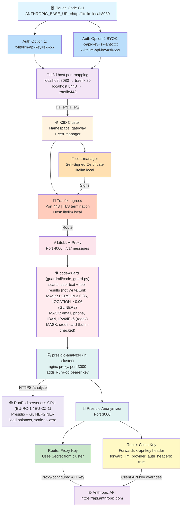

# PII-Guardian — PII-Aware AI Gateway for Claude Code

[](LICENSE)
[]()

> **Not intended for production use.** This is a local proof-of-concept built for portfolio and learning purposes. It uses self-signed certificates, a single-replica cluster, no persistent storage, and hardcoded demo credentials. Do not expose it to a network or use it to process real personal data.

A local POC that validates a GDPR defense-in-depth architecture: PII is detected, masked, and
selectively blocked by a LiteLLM + Microsoft Presidio gateway **before prompts leave your perimeter**.

---

## Quick Start

```bash
# 1. Prerequisites: Docker, k3d ≥ v5.6, kubectl ≥ v1.28, task ≥ v3.30, jq, Claude Code CLI ≥ v2.1.129

# 2. Configure your Anthropic API key
cp .env.example .env
# Edit .env and set ANTHROPIC_API_KEY=sk-ant-...

# 3. Pin image digests (one-time — commit the resulting git diff after review)
task pin-images

# 4. Run the demo
task demo
```

The demo brings up a local K3D cluster, routes Claude Code through a LiteLLM + Presidio gateway,
and walks through three scenarios proving **MASK**, **AUDIT**, and **CARD** (card masking) behaviors. (AUDIT is
currently disabled: see [9.2](#92-scenario-audit--demoscenario-auditsh).)

---

## Supply Chain

> **WARNING — NEVER run `pip install litellm` for any reason, including local development.**
>
> LiteLLM PyPI versions **1.82.7 and 1.82.8 contained credential-stealing malware**
> (documented by Anthropic). This project uses the official container image only:
> `ghcr.io/berriai/litellm:v1.102.1`, pinned to a specific SHA-256 digest.
>
> The `task pin-images` command pins digests. The `task verify-images` step (which `task up`
> depends on) fails hard if any image in the manifests lacks a `@sha256:` pin.
> **Review the `git diff manifests/` output before committing pinned digests.**

---

## Operator Prerequisites

- macOS or Linux
- Docker Desktop or Podman 4.x with Docker socket emulation
- `k3d` ≥ v5.6
- `kubectl` ≥ v1.28
- `task` (Taskfile.dev) ≥ v3.30
- `jq`
- Claude Code CLI ≥ v2.1.129
- An Anthropic API key with access to Claude models (set in `.env` as `ANTHROPIC_API_KEY`)
- Network access to `api.anthropic.com`

The API key is consumed by LiteLLM to authenticate outbound requests. Developers' Claude Code
subscriptions are separate and are not used by the gateway. See §14 of the spec for production
authentication options (including the subscription-only path).

---

## Task Reference

| Command | Description |
|---------|-------------|
| `task pin-images` | Pull images and write SHA-256 digests into manifests (run once) |
| `task up` | Create K3D cluster, apply manifests, wait for Ready |
| `task demo` | Full demo — MASK, AUDIT, CARD scenarios |
| `task down` | Stop the cluster (preserves state) |
| `task clean` | Delete the cluster entirely |
| `task verify-images` | Re-pull and verify digests match manifests |
| `task status` | Pod status + last 20 log lines + health check |
| `task logs` | Follow LiteLLM logs |
| `task reload-config` | Re-apply LiteLLM config and rolling-restart (zero downtime) |
| `task verify-netpol` | Verify CiliumNetworkPolicy — allowed traffic passes, blocked traffic is dropped |
| `task pii-score` | Score masking ratio / false-positive ratio across CSV, Markdown, and minified-JSON exports |
| `task pii-bench` | Benchmark NER backends (spaCy, GLiNER, GLiNER2) on PERSON/LOCATION in generated source files |
| `task pii-bench-gateway` | End-to-end benchmark through the running gateway (LiteLLM → proxy → RunPod GLiNER2); per-file report of what is and isn't masked in `.pii-score-out/gateway-bench/` |

---

**Status:** Implemented
**Reference docs:**
- Claude Code Network Configuration
- Claude Code LLM Gateway
- LiteLLM Presidio Guardrail
- LiteLLM Guardrails on Pass-Through Endpoints

---

## 1. Context
Acme Inc. operates Claude Enterprise with several hundred developer subscriptions. The Enterprise DPA and EU SCCs provide the legal framework for personal-data transfers to Anthropic's US-based infrastructure. To strengthen the GDPR posture with a *defense-in-depth* technical control, Acme wants to introduce a centralized AI gateway that detects, masks, and selectively blocks PII before prompts leave the perimeter.
This POC validates the architecture locally on **K3D** before any consideration of production cluster rollout. The headline deliverable is a task demo that executes against the real Anthropic API via an authenticated Claude Code CLI.

## 2. Goal
A single task demo command that:
1. Brings up a local K3D cluster with LiteLLM + Presidio (analyzer + anonymizer)
2. Configures the operator's Claude Code CLI to route through the local gateway via ANTHROPIC_BASE_URL
3. Executes three scenarios proving **MASK**, **AUDIT**, and **CARD** behaviors
4. Displays clear evidence (LiteLLM logs, before/after prompt bodies) that the protection layer worked
The POC must be reproducible and tear-downable with task clean.

## 3. Non-Goals (what Claude Code must NOT do)
Stay tight on scope. Do **not**:
- Fork or vendor third-party MITM proxies; do not write a custom MITM proxy.
- Add Langfuse, Datadog, OpenTelemetry, or any observability backend. kubectl logs is sufficient.
- Add Helm charts, ArgoCD, Flux, or GitOps tooling. Use plain kubectl apply invoked from Taskfile.
- Add Istio, Linkerd, or any service mesh.
- Add Postgres, Redis, or persistent volumes. Everything is ephemeral.
- Write custom Python guardrails. Use LiteLLM's built-in presidio guardrail only.
- Implement a mock Anthropic endpoint. The demo hits the real Anthropic API.
- Add French (fr) or other non-English Presidio support. English-only.
- Add custom recognizers (national ID schemes, customer-specific IDs). Use Presidio defaults.
- **Install LiteLLM via pip install litellm.** See section 13 — only the official container image is acceptable.

**Deliberate deviations (after the [NER benchmark](docs/ner-model-benchmark.md)):**
- **Custom recognizer.** GLiNER2 is plugged into Presidio through a small custom recognizer
  (`bench/analyzers/gliner2/gliner2_recognizer.py`), because Presidio's built-in `GLiNERRecognizer`
  can't load GLiNER2 checkpoints.
- **Multilingual detection.** The model detects French, English, Spanish and Italian names and
  places while Presidio is still called with `language: en`.
- **External analyzer.** Analysis runs on a RunPod GPU in the EU instead of inside the cluster.
- **Custom guardrail.** One small Python guardrail, [`guardrail/code_guard.py`](guardrail/code_guard.py),
  replaces the built-in presidio and regex guardrails. The built-ins can't tell a Read result from
  an Edit result, can't spare code files or paths, and scan Claude's system prompt and own
  replies. See [PII scope for Claude Code](#pii-scope-for-claude-code) and the
  [guardrail report](docs/claude-code-guardrail.md).

## 4. Architecture

The integration follows the officially documented LLM gateway pattern: Claude Code is pointed at LiteLLM via ANTHROPIC_BASE_URL, authenticates to LiteLLM via ANTHROPIC_AUTH_TOKEN, and LiteLLM forwards to Anthropic using its own configured API key.


```mermaid
graph TD
    CLI["🖥️ Claude Code CLI<br/>ANTHROPIC_BASE_URL=http://litellm.local:8080"]
    
    CLI1["Auth Option 1:<br/>x-litellm-api-key=sk-xxx"]
    CLI2["Auth Option 2 BYOK:<br/>x-api-key=sk-ant-xxx<br/>x-litellm-api-key=sk-xxx"]
    
    PF["🚦 k3d host port mapping<br/>localhost:8080 → traefik:80<br/>localhost:8443 → traefik:443"]
    
    K3D["☸️ K3D Cluster<br/>Namespace: gateway<br/>+ cert-manager"]
    
    CERT["🔐 cert-manager<br/>Self-Signed Certificate<br/>litellm.local"]
    
    TRAEFIK["🚦 Traefik Ingress<br/>Port 443 | TLS termination<br/>Host: litellm.local"]
    
    LLM["⚡ LiteLLM Proxy<br/>Port 4000 | /v1/messages"]
    
    PRE["🛡️ code-guard (guardrail/code_guard.py)<br/>scans: user text + tool results (not Write/Edit)<br/>MASK: PERSON ≥ 0.85, LOCATION ≥ 0.96 (GLiNER2)<br/>MASK: email, phone, IBAN, IPv4/IPv6 (regex)<br/>MASK: credit card (Luhn-checked)"]
    
    ANALYZER["🔍 presidio-analyzer (in cluster)<br/>nginx proxy, port 3000<br/>adds RunPod bearer key"]
    
    RUNPOD["🟣 RunPod serverless GPU (EU-RO-1 / EU-CZ-1)<br/>Presidio + GLiNER2 NER<br/>load balancer, scale-to-zero"]
    
    ANON["🔐 Presidio Anonymizer<br/>Port 3000"]
    
    ROUTE1["Route: Proxy Key<br/>Uses Secret from cluster"]
    ROUTE2["Route: Client Key<br/>Forwards x-api-key header<br/>forward_llm_provider_auth_headers: true"]
    
    ANTHROPIC["🌐 Anthropic API<br/>https://api.anthropic.com"]
    
    CLI --> CLI1
    CLI --> CLI2
    CLI1 --> PF
    CLI2 --> PF
    PF -->|HTTP/HTTPS| K3D
    K3D --> CERT
    K3D --> TRAEFIK
    CERT -->|Signs| TRAEFIK
    TRAEFIK -->|Route| LLM
    
    LLM --> PRE
    PRE --> ANALYZER
    ANALYZER -->|HTTPS /analyze| RUNPOD
    ANALYZER --> ANON
    
    ANON --> ROUTE1
    ANON --> ROUTE2
    
    ROUTE1 -->|Proxy-configured API key| ANTHROPIC
    ROUTE2 -->|Client API key overrides| ANTHROPIC
    
    style CLI fill:#e1f5ff
    style CLI1 fill:#bbdefb
    style CLI2 fill:#bbdefb
    style PF fill:#f3e5f5
    style K3D fill:#fff3e0
    style CERT fill:#ffe0b2
    style TRAEFIK fill:#ffccbc
    style LLM fill:#fce4ec
    style PRE fill:#ffebee
    style ANALYZER fill:#e0f2f1
    style RUNPOD fill:#ede7f6
    style ANON fill:#e0f2f1
    style ROUTE1 fill:#c8e6c9
    style ROUTE2 fill:#fff9c4
    style ANTHROPIC fill:#f3e5f5
```

### Authentication Modes

The diagram shows two auth paths supported by `forward_llm_provider_auth_headers`:

| Mode | Use Case | Header | How It Works |
|------|----------|--------|--------------|
| **Proxy Mode** (POC default) | Centralized auth, shared costs | `x-litellm-api-key=sk-poc-...` | LiteLLM uses its Kubernetes Secret API key; client auth is just to unlock the proxy. |
| **BYOK** (Bring Your Own Key) | Client pays directly, audit per-developer | `x-api-key=sk-ant-...`<br/>`x-litellm-api-key=sk-poc-...` | LiteLLM forwards the client's API key to Anthropic, overriding the proxy key. |

### Why This Matters

- **POC (this project):** Uses Proxy Mode — one shared API key from the Kubernetes Secret. Simpler for demo. Cost is centralized.
- **Production BYOK:** When enabled (`forward_llm_provider_auth_headers: true`), each developer uses their own subscription/API key. LiteLLM still provides PII masking, audit logging, and per-session attribution — but billing is per-developer. This satisfies the "subscription-only" constraint.

**Why this pattern over HTTPS_PROXY:** the LLM-gateway pattern is documented and supported by Anthropic, requires no TLS interception, no CA distribution, and no MITM. The guardrails see the request body as structured JSON, not bytes to demangle from a TLS tunnel.

### PII detection: GLiNER2 on a RunPod GPU

Names and places (PERSON, LOCATION) are detected by **GLiNER2**
(`fastino/gliner2-privacy-filter-PII-multi`) instead of Presidio's default spaCy model. In the
[benchmark](docs/ner-model-benchmark.md), GLiNER2 was the only model that masked names and places
in source code without masking code tokens. spaCy masked identifiers such as `s.Carrier`, `nil` and
`s.City`, which broke 19 of 27 files.

Deterministic values (emails, phone numbers, IBANs, IPv4/IPv6 addresses) don't need a model. They
are matched by regexes in the same guardrail, inside the LiteLLM pod, in one pass with GLiNER2 over
the original text. IBANs are masked (and checksum-verified), not blocked. Credit cards are masked
too (`<CREDIT_CARD>`, Luhn-checked by Presidio), not blocked: Claude Code resends the whole
conversation every turn, so a blocked card in one tool result would fail every later request.

GLiNER2 needs a GPU to be usable on the request path (about 12 s per 10 KB on a laptop CPU), so the
analyzer runs as a **RunPod serverless endpoint** and the cluster keeps a thin proxy:

```
code-guard (LiteLLM) ──► presidio-analyzer Service (k3d, same name/port as before)
                           └─ nginx proxy: adds "Authorization: Bearer <RunPod key>"; /health answered locally
                                └─► https://<endpoint-id>.api.runpod.ai/analyze   (kept-alive TLS connections)
                                      └─ Presidio + GLiNER2 on 1 GPU (EU-RO-1 / EU-CZ-1), 0 workers when idle
```

- **Why a proxy.** The guardrail never holds the RunPod key: the proxy adds it, and the
  RunPod endpoint rejects unauthenticated calls (401). The proxy keeps the `presidio-analyzer`
  Service name, label and port, so LiteLLM's config and the CiliumNetworkPolicy don't change. Its
  health probe is answered locally, so Kubernetes probes never wake (and bill) a GPU worker.
- **Data residency.** Workers are restricted to RunPod data centers in EU member states that RunPod
  tags GDPR-compliant: EU-RO-1 (Romania) and EU-CZ-1 (Czechia). The text sent to `/analyze` is the
  *unmasked* prompt, so this is a sub-processor for personal data.
- **Image.** `ghcr.io/bricelalu/pii-guardian-analyzer-gliner2`, **private** on GHCR, pinned by
  digest. RunPod pulls it with its own GitHub token that has only `read:packages`.
- **Fail closed.** If the analyzer errors or times out, the guardrail **blocks** the request rather
  than forwarding it unmasked.
- **Cold start.** After an idle period, a fresh worker takes 80–100 s to become ready (6.5 minutes
  the very first time: claiming a GPU, then unpacking the 9.6 GB image). Requests during that window are held by the
  guardrail's retries (up to about 3 minutes), then blocked. Wake the endpoint before a demo.
- **Cost.** 16 GB GPU tier at $0.58/h, 24 GB tier at $0.69/h as fallback, billed per second while a
  worker runs, $0 when idle.

The endpoint is defined in [`infra/runpod/endpoint.yaml`](infra/runpod/endpoint.yaml) and created
with `infra/runpod/create-endpoint.sh` (needs `RUNPOD_API_KEY=rpa_xxx` in `.env` and `yq` v4).

`task up` needs `RUNPOD_API_KEY` and `RUNPOD_ENDPOINT_ID` in `.env`. It stores them in the
`runpod-analyzer` Secret, which only the proxy reads. Between demos, set the endpoint's
`workers.max` to `0` so nothing can bill, and back to `1` beforehand. Allow for the cold start.

The proxy reaches RunPod through an nginx `upstream` with `keepalive` (one TLS handshake reused
across calls) and `resolve` (the name is re-resolved while running, through cluster DNS, IPv4 only:
RunPod publishes IPv6 addresses too, but the cluster has no IPv6 egress).

### PII scope for Claude Code

The gateway sits between Claude Code on developer laptops and the Anthropic API, so masking must
never break a tool call. `code-guard` ([`guardrail/code_guard.py`](guardrail/code_guard.py)) masks
only what can carry a third party's PII. Full report, with every measurement:
[docs/claude-code-guardrail.md](docs/claude-code-guardrail.md).

| Part of the `/v1/messages` request | Masked? | Why |
|---|---|---|
| What the developer types (user text blocks) | ✅ | Prompts, pasted data |
| MCP tool results (JSON, Markdown tables, CSV) | ✅ | Customer data from other systems. Escaped documents inside JSON strings (a table in a `content` field, JSON in JSON) are decoded and masked as documents of their own |
| Bash and other tool results (no file can be attributed to them) | ✅ | Command output; a `Bash` command is arbitrary shell, not a path |
| Grep / Glob lines attributed to a data file | ✅ | Search hits; a hit inside `customers.csv` is still an export |
| Read of a data file (`.csv`, `.json`, `.md`, `.txt`, `.sql`, …, or unknown type) | ✅ | Exports and dumps; the list is `data_extensions` in the config |
| Read of a code file (`.py`, `.ts`, `.go`, `.tf`, `Dockerfile`, …) or of a notebook (`.ipynb`) | ❌ | Claude quotes it exactly in its Edits; the language is recognized with `pygments`, which ships with LiteLLM's proxy image |
| Read of a `file_path` a Write / Edit / MultiEdit / NotebookEdit targets anywhere in the same request | ❌ | The request is the source of truth that this exact file (matched by identical `file_path` string, never basename) is being edited right now, whatever its extension |
| Grep / Glob lines attributed to a code file | ❌ | Same reason: each line is checked (`path:line:text`) against the file it names |
| Write / Edit / MultiEdit / NotebookEdit results | ❌ | They echo the file being edited; a mask there breaks the next Edit |
| `tool_use` input (paths, commands, `old_string`) | ❌ | Claude's own tool calls must reach the tools unchanged |
| System prompt, Claude's own replies | ❌ | Written by Claude Code / Claude, rescanning them only adds latency |
| Paths and URLs (`/Users/<name>/…`, `https://…`, `Europe/Paris`) | ❌ | A masked path breaks every tool call that reuses it |

Also never masked: role words that GLiNER2 mistakes for people ("customer 2", "user 42", "the
customer"), and infrastructure IPs (private, loopback, link-local, public DNS resolvers) that show
up in `kubectl` and log output.

**Can Claude Code still work?** `guardrail/claude_ab.py` runs the same `claude -p` tasks directly
and through the gateway on a small CRM repo full of customer PII (Haiku 4.5, 2 runs each):

| Task | Direct | Gateway, every Read masked | Gateway, current rules |
|---|---|---|---|
| Fix a bug on a line without PII | 2/2 | 2/2 | 2/2 |
| Change one customer's plan in `customers.py` | 2/2 | 1/2, 4 failed Edits | **2/2** |
| Add a function and its test | 2/2 | **0/2, placeholders written into the test file** | **2/2** |
| Fix one cell in `customers.csv` | 2/2 | 1/2, 13 failed Edits | 0/2 (by design) |

A masked file can't be edited on its masked lines: Claude quotes `<PERSON>` in its `old_string`,
which isn't on disk. So code files reach Claude as they are, data files stay masked, and **editing
a data file's PII cells through the gateway doesn't work**. PII inside code files (author lines,
test fixtures) does reach Anthropic.

**Latency.** A 12 KB export takes 1.7 s through the gateway the first time and 0.47 s once cached:
NER results are cached per block, because Claude Code resends the whole conversation every turn.
On the A/B tasks, Claude Code was about 1.5–2× slower through the gateway. Splitting documents into
chunks didn't pay off; the details are in the report.

**Checks** (in [`guardrail/`](guardrail/)): `test_code_guard.py` (offline unit tests),
`scope_check.py` (which blocks of a real request reach Anthropic masked), `regex_sweep.py` (regex false
positives on real code), `replay_sessions.py` (your own sessions, locally), `claude_ab.py` (the
A/B above).

### TLS & cert-manager

The POC now includes **production-grade TLS termination** using cert-manager and self-signed certificates:

- **cert-manager** automatically installs and manages certificates in Kubernetes
- **Traefik ingress controller** terminates TLS at port 443
- **Self-signed issuer** provisions certificates for `litellm.local` (automatically in K3D)

**For local development** (no port-forward needed):
```bash
# k3d maps host ports directly via the built-in loadbalancer
export ANTHROPIC_BASE_URL=http://litellm.local:8080   # HTTP — no cert needed
# or HTTPS (self-signed, use -k with curl):
export ANTHROPIC_BASE_URL=https://litellm.local:8443
export ANTHROPIC_AUTH_TOKEN=sk-xxx
```

The host port mapping (`8080:80`, `8443:443`) is declared in `k3d/cluster.yaml`. A `HelmChartConfig` (`manifests/15-traefik-config.yaml`) configures Traefik to bind `hostPort: 80/443` on the server node, so traffic reaches Traefik without any port-forward. Add both lines to `/etc/hosts` (`task up` doesn't write them):

```
127.0.0.1       litellm.local
::1             litellm.local
```

The `::1` line matters on macOS: without it, the IPv6 lookup of a `.local` name goes to mDNS and
times out after 5 s, and Claude Code doesn't cache DNS, so **every request** waits 5 s.

In production, replace the `ClusterIssuer: selfsigned` with Let's Encrypt or your organization's CA.

## 5. Repository Structure

```
pii-guardian/
├── README.md
├── LICENSE
├── Taskfile.yml
├── .env.example                        # template for ANTHROPIC_API_KEY + LITELLM_MASTER_KEY
├── k3d/
│   └── cluster.yaml                    # k3d cluster definition (host port mapping)
├── guardrail/
│   ├── code_guard.py                   # the LiteLLM guardrail (mounted as /app/code_guard.py)
│   ├── test_code_guard.py              # offline unit tests
│   ├── scope_check.py                  # which /v1/messages blocks get scanned (live gateway)
│   ├── regex_sweep.py                  # regex false positives over real source files
│   ├── replay_sessions.py              # your own Claude Code sessions through the regexes
│   └── claude_ab.py                    # claude -p tasks, direct vs through the gateway
├── manifests/
│   ├── 00-namespace.yaml
│   ├── 10-presidio-analyzer.yaml       # nginx proxy to the GLiNER2 analyzer on RunPod
│   ├── 11-presidio-anonymizer.yaml
│   ├── 15-traefik-config.yaml          # HelmChartConfig — hostPort 80/443 for k3d
│   ├── 21-litellm-config.yaml          # ConfigMap: models + code-guard settings
│   ├── 22-litellm.yaml                 # Deployment (mounts config.yaml and code_guard.py) + Service
│   ├── 25-certificate-issuer.yaml      # cert-manager ClusterIssuer + Certificate
│   ├── 26-litellm-ingress.yaml         # Traefik Ingress (HTTPS + HTTP)
│   ├── 30-postgres.yaml
│   └── 40-litellm-netpol.yaml          # CiliumNetworkPolicy — egress locked to Presidio + Anthropic
├── demo/
│   ├── scenario-mask.sh
│   ├── scenario-audit.sh
│   ├── scenario-card.sh
│   └── show-evidence.sh
├── scripts/
│   └── pii-score/
│       ├── data/                       # curated open-data samples + SOURCES.md (licences)
│       ├── fetch_opendata.py           # refreshes data/ from INSEE, data.gouv.fr, BAN
│       ├── customers.py                # builds the 50-row customers table + per-cell answer key
│       ├── export.sh                   # exports it as CSV / Markdown / minified JSON (sqlite3)
│       ├── run.sh                      # task pii-score: exports through the gateway
│       ├── bench.sh                    # task pii-bench: runs every analyzer variant
│       ├── span_score.py               # span-level P/R/F1 + false-positive token report
│       ├── bench-gateway.sh            # task pii-bench-gateway: code + exports through the gateway
│       ├── gateway_bench.py            # sends files through the guardrails, per-file report
│       └── common.py                   # shared helpers
├── bench/
│   ├── analyzers/                      # one Dockerfile per NER variant
│   │   └── gliner2/                    # also the RunPod GPU image (requirements-cuda-amd64.txt, runpod_app.py)
│   └── corpus/                         # code templates, per-language fixtures, generator
├── infra/
│   └── runpod/
│       ├── endpoint.yaml               # RunPod serverless endpoint (REST v2 body)
│       └── create-endpoint.sh          # creates it from endpoint.yaml
└── docs/
    ├── ner-model-benchmark.md          # NER model comparison and executive summary
    ├── claude-code-guardrail.md        # code-guard: scope, rules, A/B with Claude Code, latency
    └── notes.md
```

## 6. Component Specifications
### 6.1 K3D Cluster
- Single-node cluster named claude-gateway-poc
- K3s version: latest stable (pin in k3d/cluster.yaml)
- **Traefik enabled** (default; used for ingress — HTTP port 8080, HTTPS port 8443)
- ServiceLB (Klipper) disabled — the Kubernetes-level IP allocator for LoadBalancer Services is not needed here
- Host connectivity via k3d's nginx sidecar container, which maps `localhost:8080→node:80` and `localhost:8443→node:443` at the Docker layer (declared in `k3d/cluster.yaml`)
- Traefik configured via `HelmChartConfig` to bind `hostPort: 80/443` on the server node so the nginx sidecar can reach it
- **Cilium CNI** replaces the default flannel — required for `CiliumNetworkPolicy` enforcement on LiteLLM egress
- Cilium runs with `kubeProxyReplacement=false` but `nodePort.enabled=true` and `hostPort.enabled=true`. Flannel's `portmap` plugin used to implement Traefik's `hostPort: 80/443`; without these two settings, Cilium doesn't implement host ports at all, and `litellm.local:8080`/`:8443` get no answer from the host. `rollOutCiliumPods=true` makes Helm restart the agents when this config changes (otherwise the new ConfigMap is ignored until the next restart).

**k3d limitation — FQDN egress policy:** In production Kubernetes (EKS, GKE, etc.), `manifests/40-litellm-netpol.yaml` uses `toFQDNs: [{matchName: "api.anthropic.com"}]` to restrict external egress to Anthropic's IPs only. In k3d, Cilium's DNS proxy redirect (eBPF/iptables hooks for pod-level DNS interception) does not function inside Docker-in-Docker nodes — the FQDN cache stays empty regardless of mode. The manifest uses `toEntities: world` port 443 as the k3d-compatible equivalent, restricting external egress to HTTPS only. The production form is preserved as a comment in the manifest. See upstream: [cilium/cilium#19045 — toFQDNs not working](https://github.com/cilium/cilium/issues/19045).

### 6.2 Presidio Analyzer
The analyzer itself runs on RunPod (see [PII detection: GLiNER2 on a RunPod GPU](#pii-detection-gliner2-on-a-runpod-gpu)).
In the cluster, `presidio-analyzer` is an auth-adding proxy:
- Image: `nginxinc/nginx-unprivileged:1.29-alpine`, pinned by digest
- Replicas: 1
- Resources: requests 50m CPU / 32Mi memory; limits 500m CPU / 128Mi memory
- ClusterIP service, port 3000; forwards only `POST /analyze`, with a 300 s read timeout for cold starts
- Reaches RunPod through an `upstream` with `keepalive` (reused TLS connections) and `resolve`
  (re-resolved via kube-dns while running, IPv4 only: the cluster has no IPv6 egress)
- Liveness/readiness on `/health`, answered by nginx itself (never forwarded)
- Env from Secret `runpod-analyzer`: `RUNPOD_API_KEY`, `RUNPOD_ENDPOINT_ID`

RunPod image (`bench/analyzers/gliner2/Dockerfile`, built with
`--build-arg REQUIREMENTS=gliner2/requirements-cuda-amd64.txt`):
- `FROM` the pinned `mcr.microsoft.com/presidio-analyzer` digest; spaCy NER disabled, GLiNER2
  registered as a custom recognizer; pattern recognizers unchanged
- Served by gunicorn via `runpod_app.py`: `GET /ping` returns 204 while the model loads, 200 once
  ready, 500 if loading failed
- `PYTORCH_NVML_BASED_CUDA_CHECK=1` and `PRESIDIO_DEVICE=cuda`: without them, CUDA is initialized in
  gunicorn's master before it forks, and the worker fails with "Cannot re-initialize CUDA in forked
  subprocess"
### 6.3 Presidio Anonymizer
Still deployed, but not called: `code-guard` replaces the detected spans itself.
- Image: mcr.microsoft.com/presidio-anonymizer (pin to a specific tag and digest at scaffolding time)
- Replicas: 1
- Resources: requests 100m CPU / 128Mi memory; limits 200m CPU / 256Mi memory
- ClusterIP service, port 3000
- Liveness/readiness on /health
### 6.4 LiteLLM
**Image source is non-negotiable:** use ghcr.io/berriai/litellm at an immutable release tag (currently v1.102.1) only, pinned to a specific image digest at scaffolding time. **Never** install via PyPI. See section 13 for the supply-chain rationale.
- Replicas: 1
- Config mounted from ConfigMap to /app/config.yaml
- Guardrail module mounted from ConfigMap `litellm-guardrail` (created from `guardrail/code_guard.py`
  by `task up` and `task reload-config`) to /app/code_guard.py, next to the config, where LiteLLM
  loads `guardrail: code_guard.CodeGuard` from
- Service: ClusterIP, port 4000
- Required env (from Secret litellm-secrets):
  - ANTHROPIC_API_KEY — Anthropic API key used by LiteLLM to call Anthropic
  - LITELLM_MASTER_KEY — proxy key; the value Claude Code sends as ANTHROPIC_AUTH_TOKEN (see .env)
- Required env (from ConfigMap or inline):
  - PRESIDIO_ANALYZER_API_BASE=http://presidio-analyzer.gateway.svc.cluster.local:3000
  - PRESIDIO_ANONYMIZER_API_BASE=http://presidio-anonymizer.gateway.svc.cluster.local:3000
  - LITELLM_LOG=DEBUG
- Args: ["--config", "/app/config.yaml", "--port", "4000", "--detailed_debug"]
### 6.5 LiteLLM Configuration
The ConfigMap `litellm-config` contains `config.yaml`:

```yaml
model_list:
  - model_name: "claude-*"
    litellm_params:
      model: "anthropic/*"
      api_key: "os.environ/ANTHROPIC_API_KEY"
general_settings:
  master_key: "os.environ/LITELLM_MASTER_KEY"
guardrails:
  # One guardrail, guardrail/code_guard.py, mounted next to config.yaml (ConfigMap
  # litellm-guardrail, created by task up / task reload-config). Scope: user text and tool
  # results, never Write/Edit results, tool_use input, system prompt, paths or URLs.
  - guardrail_name: "code-guard"
    litellm_params:
      guardrail: code_guard.CodeGuard
      mode: "pre_call"
      default_on: true
      # Names and places (NER): Presidio + GLiNER2 on RunPod. Cutoffs from
      # docs/ner-model-benchmark.md. Credit cards (Luhn-checked) are masked, not blocked.
      ner_thresholds:
        PERSON: 0.85
        LOCATION: 0.96
        CREDIT_CARD: 0.6
      block_entities: []
      skip_tools: ["Write", "Edit", "MultiEdit", "NotebookEdit"]
      # Read results of code files (pygments knows the language) are not masked, except these:
      data_extensions: [".csv", ".tsv", ".json", ".jsonl", ".ndjson", ".md", ".markdown", ".txt", ".log", ".xml", ".sql"]
      # Email, IPv4/IPv6, phones, IBAN: REGEXES in guardrail/code_guard.py (unit-tested).
      # presidio-audit (logging_only) is commented out in manifests/21-litellm-config.yaml.
litellm_settings:
  set_verbose: true
  json_logs: true
```

Claude Code sends these attribution headers on every request: X-Claude-Code-Session-Id, X-Claude-Code-Agent-Id, X-Claude-Code-Parent-Agent-Id. The implementer must verify they appear in LiteLLM logs (they typically do with set_verbose: true and json_logs: true). If not, add the appropriate LiteLLM logging config to capture inbound headers. These are documented in the Claude Code LLM gateway docs and are essential for per-session DPO audit.

### 6.6 cert-manager & TLS Ingress
**cert-manager (v1.13.0 or later):**
- Installs automatically via official release manifest (task up applies it from GitHub)
- Creates a self-signed ClusterIssuer named "selfsigned"
- Mounts certificates as Kubernetes Secrets

**TLS Certificate (manifests/25-certificate-issuer.yaml):**
- Self-signed certificate for `litellm.local` (and `litellm.gateway.svc.cluster.local` for in-cluster access)
- Valid for 90 days; auto-renewal at 30-day mark
- Stored in Secret `litellm-tls` in the gateway namespace

**Traefik Ingress (manifests/26-litellm-ingress.yaml):**
- Listens on port 443 (HTTPS)
- Terminates TLS using the certificate from `litellm-tls`
- Routes traffic to LiteLLM service (port 4000, internal plaintext)
- Configured for Traefik annotations (router.entrypoints: websecure)

**Why self-signed for the POC:** Simplifies local testing (no external CA needed, no DNS setup). In production, replace the `selfsigned` issuer with Let's Encrypt (via HTTP-01 or DNS-01 challenge) or your organization's internal CA.

## 7. Taskfile Requirements
Taskfile.yml must define these tasks, each with a desc: field:
| Task | Behavior |
|------|----------|
| task up | Create K3D cluster (idempotent), generate Secret from .env, apply manifests, wait for Ready |
| task down | Stop the K3D cluster but preserve state |
| task clean | Delete the K3D cluster entirely |
| task verify-images | Re-pull every image and verify the digest matches what is declared in manifests; fail if mismatch |
| task status | Pod status + last 20 log lines + curl health check on LiteLLM |
| task logs | kubectl logs -n gateway -l app=litellm -f |
| task reload-config | Re-apply the LiteLLM ConfigMap and the `litellm-guardrail` ConfigMap (from `guardrail/code_guard.py`), then rolling-restart the deployment |
| task demo | The headline task — see section 8 |
task up must depend on task verify-images. Errors must surface clearly; avoid silent: true unless suppressing genuine noise.

## 8. The task demo Task
Sequence:
1. Verify .env exists with ANTHROPIC_API_KEY set; fail fast if not
2. Run task up (idempotent — skip if already running)
3. Wait for LiteLLM `/health/liveliness` to return 200 via ingress (poll up to 60s)
4. Display setup banner with required env vars for the operator's shell:
   ```
   export ANTHROPIC_BASE_URL=http://litellm.local:8080
   export ANTHROPIC_AUTH_TOKEN=sk-xxx
   ```
5. Run **Scenario 1: MASK** → demo/scenario-mask.sh
6. Pause for keypress (read -n 1 -p "Press any key for Scenario 2...")
7. Run **Scenario 2: AUDIT** → demo/scenario-audit.sh
8. Pause
9. Run **Scenario 3: CARD** → demo/scenario-card.sh
10. Final banner: "Demo complete. Run task logs for the full audit trail."

## 9. Demo Scenarios
Each scenario script must:
- Set `ANTHROPIC_BASE_URL=http://litellm.local:8080` and `ANTHROPIC_AUTH_TOKEN` for the claude invocation
- Run claude -p "<prompt>" for non-interactive execution against the local gateway
- Capture LiteLLM logs *during* the call (e.g., kubectl logs --since=10s snapshot after the call)
- Print three blocks with clear visual separators:
  - **What the operator typed** (with PII visible)
  - **What LiteLLM forwarded to Anthropic** (extracted from logs)
  - **Claude's response**
- Print a one-line verdict (✓ or ✗) explaining what was proven
### 9.1 Scenario MASK — demo/scenario-mask.sh
**Prompt:**
> "Please rewrite this email more politely: 'Hey John Smith, your delivery to john.smith@example.com is delayed. Call us at +33 6 12 34 56 78.'"
**Expected evidence:**
- LiteLLM logs show `<PERSON>`, `[EMAIL_REDACTED]`, `[PHONE_INTERNATIONAL_REDACTED]` in the body forwarded to Anthropic
- code-guard masked the name (GLiNER2), the email and the phone (regexes)
- Claude responds with a rewritten email referencing placeholders (acceptable for the demo)
**Verdict line:** "PII redacted before reaching Anthropic."
### 9.2 Scenario AUDIT — demo/scenario-audit.sh
**Prompt:**
> "Our team meeting is scheduled for next Tuesday at our Paris office. Sarah will present the Q3 forecast."
**Expected evidence:**
- ⚠️ **Currently not applicable:** the `presidio-audit` logging_only guardrail is commented out
  in `manifests/21-litellm-config.yaml`, and code-guard masks *Paris* and *Sarah* anyway. This
  scenario still runs in `task demo` but shows no audit event until the audit layer is back.
**Verdict line:** "Soft PII not blocked, but flagged for review. This is the safety net."
### 9.3 Scenario CARD — demo/scenario-card.sh
**Prompt:**
> "Help me parse this transaction log: card 4111-1111-1111-1111 charged 89.50 EUR on 2026-05-12."
**Expected evidence:**
- code-guard detects CREDIT_CARD (Luhn-checked) and masks it: the body forwarded to Anthropic
  holds `<CREDIT_CARD>`
- Claude answers normally, and later requests of the session keep working (a blocked card used to
  fail every later request, because Claude Code resends the whole conversation)
**Verdict line:** "Credit card masked — Anthropic never saw the number, and the session keeps working."

## 10. Show-Evidence Helper
demo/show-evidence.sh is invoked by each scenario. It must:
- Snapshot LiteLLM logs from the last N seconds (kubectl logs --since=10s)
- Filter for guardrail-related lines (grep for guardrail, presidio, BlockedPii, X-Claude-Code-Session-Id)
- Pretty-print JSON log lines via jq if installed; fall back to raw output otherwise
- Highlight the messages field of the forwarded request body so the operator visually confirms what crossed the boundary

## 11. Acceptance Criteria
A reviewer running task demo on a clean machine must observe:
1. K3D cluster + pods become ready (first run ~3–5 min for image pulls inside k3d's containerd; subsequent `task down` / `task up` is fast — images are cached)
2. Three scenarios execute sequentially with clear visual demarcation
3. **MASK** scenario shows side-by-side "user input" vs "sent to Anthropic" with PII visibly redacted
4. **AUDIT** scenario shows a detection log entry without prompt modification (currently disabled, see 9.2)
5. **CARD** scenario shows `<CREDIT_CARD>` in the body forwarded to Anthropic, and Claude still answers
6. task verify-images confirms image digests match before task up proceeds
7. task clean removes the cluster in under **30 seconds**
8. Re-running task demo after task clean works without manual intervention

## 12. Operator Prerequisites (document in README.md)
- macOS or Linux
- Docker Desktop or Podman 4.x with Docker socket emulation
- k3d ≥ v5.6
- kubectl ≥ v1.28
- task (Taskfile.dev) ≥ v3.30
- jq
- Claude Code CLI ≥ v2.1.129
- `/etc/hosts` entries for `litellm.local` on both `127.0.0.1` and `::1` (see [TLS & cert-manager](#tls--cert-manager))
- **An Anthropic API key with access to Claude models** — needed to populate the ANTHROPIC_API_KEY Secret consumed by LiteLLM. The POC uses an API key because the LLM gateway pattern documented by Anthropic terminates auth at LiteLLM. See section 14 for the production implication.
- Network access to api.anthropic.com

## 13. Supply Chain Hardening (mandatory)
Anthropic's official documentation explicitly warns that **LiteLLM PyPI versions 1.82.7 and 1.82.8 were compromised with credential-stealing malware**. The POC must enforce the following:
- LiteLLM is consumed exclusively via the official container image ghcr.io/berriai/litellm at an immutable release tag (currently v1.102.1), **pinned to a specific image digest** at scaffolding time (use docker pull + docker inspect to capture the digest, write it into the manifest as image: ghcr.io/berriai/litellm@sha256:<digest>).
- The Taskfile.yml must include a task verify-images that re-pulls each image and checks the digest matches what is declared in the manifests. Run this as part of task up.
- The README.md must contain a "Supply chain" section explicitly forbidding pip install litellm for any reason, including local development.
- Presidio images come from mcr.microsoft.com (Microsoft-controlled registry) and must also be pinned by digest.
- The GLiNER2 analyzer image (RunPod) is built `FROM` that pinned Presidio digest. Every pip package
  is installed with `--require-hashes` (`bench/analyzers/gliner2/requirements*.txt`, compiled with
  `uv`). It uses `gliner2[local]`, never bare `gliner2`, which is only a client for Fastino's hosted
  API and would send the text being scanned off-box. The model is pinned to a Hugging Face commit
  and baked into the image, and the container runs in Hugging Face offline mode. The image is
  private on GHCR and referenced by `@sha256` digest in `infra/runpod/endpoint.yaml`.
This is non-negotiable. A PII protection layer compromised by malware is strictly worse than no PII protection layer.

## PII Detection Scoring (`task pii-score`)
Exports a fictional **customer table** the way a developer would paste it into Claude Code, and
checks what the gateway masks in each format: CSV, Markdown table and minified JSON.

**The data** (`scripts/pii-score/customers.py`, 50 rows, fixed seed): one row per customer, the
same 16 columns in every format.

| Column | Example | Handled by |
|---|---|---|
| `id`, `customer_ref` (UUID), `created_at`, `status`, `plan` | `7`, `d777a477-…`, `active`, `pro` | safe: must stay untouched |
| `firstname`, `lastname` | `jean-Michel` `MOREAU` | code-guard, GLiNER2 (PERSON) |
| `address`, `city`, `country` | `3 Rue des Pins`, `Neubois`, `France` | code-guard, GLiNER2 (LOCATION) |
| `customer_email`, `phone_number`, `iban`, `last_login_ip` | `e.peron@…`, `06.39.98.88.49`, `FR76 …`, `192.0.2.33` | code-guard, regexes |
| `zipcode`, `birth_date` | `59540`, `1981-04-20` | not masked by design (not scored) |

- **Origins:** 70% French rows, with first names from INSEE, surnames from data.gouv.fr and real
  street addresses, postcodes and cities from the Base Adresse Nationale. 10% each Spanish,
  Italian and English rows. Sources and licences: `scripts/pii-score/data/SOURCES.md`.
- **Casing:** exactly 30% of first names start lowercase; last names are split evenly between
  UPPERCASE, lowercase and Capitalized.
- **Phones:** French numbers use ARCEP's ranges reserved for fiction, in four formats. UK numbers
  use Ofcom's drama range.
- **IBANs and IPs:** IBANs have valid checksums, spaced or compact. IPs come from the
  documentation ranges.

**How it runs:** `export.sh` renders `SELECT * FROM customers` with sqlite3 (`-header -csv`,
`-markdown`, `-json | jq -c`). `customers.py truth` records the exact position of every cell.
Each export then goes through the running gateway's guardrail (`/guardrails/apply_guardrail`:
`code-guard` → RunPod GLiNER2 + regexes).

Run it with `task pii-score`. It needs `task up` and a RunPod worker allowed (`workers.max ≥ 1`).
Output in `.pii-score-out/`:
- `report.md`: masked cells per column and format, plus every value that was or wasn't masked,
  with its row and column;
- `masked/`: exactly what LiteLLM would send to Anthropic.

Refresh the French open-data samples with `python3 scripts/pii-score/fetch_opendata.py`.

Extra prerequisite beyond §12: **sqlite3 ≥ 3.33**, for the `-markdown`/`-json` export modes. It
ships with macOS and most Linux distributions.

### Model benchmark (`task pii-bench`)
Findings and executive summary: [docs/ner-model-benchmark.md](docs/ner-model-benchmark.md).

Compares Presidio analyzer variants that differ **only in their NER component** (the stock
pattern recognizers for email, card, IBAN and phone are kept in every variant):

| Variant | NER backend | Notes |
|---|---|---|
| `spacy-en` | `en_core_web_lg` | What the gateway ran before GLiNER2; everything analyzed as `en` |
| `spacy-multi` | `en_core_web_lg` + `fr/es/it_core_news_md` | Given each file's language up front: an **upper bound**, since the gateway always sends `en` |
| `gliner` | `urchade/gliner_multi_pii-v1` | Presidio's built-in `GLiNERRecognizer` |
| `gliner2` | `fastino/gliner2-privacy-filter-PII-multi` | Small custom recognizer (`bench/analyzers/gliner2/`) |

It scores **PERSON and LOCATION only**, the NER-driven entities that are hardest to mask. The
input is a generated corpus of realistic source files (Terraform, TypeScript, Python, Go, Java,
Rust) in French, English, Spanish and Italian (`bench/corpus/`). PII appears only where it really
shows up in code (author comments, fixtures, seed data), surrounded by identifiers that look like
names or places (`dallasRetryPolicy`, `paris_gateway`, `s.City`, `nil`). The report gives
precision, recall and F1 per language, at the gateway's thresholds and at each model's best
threshold. It also lists **exactly which code tokens each model mis-flags**.

Each variant runs as a local Docker container, one at a time. Images are built from
`bench/analyzers/*/Dockerfile` on the pinned analyzer digest, with hash-pinned pip packages
(CPU-only torch). Model weights are pinned to a Hugging Face commit and baked in at build time,
and the containers run in Hugging Face offline mode. The first run builds the images (a few GB).
`BENCH_LANGS=fr` and `BENCH_VARIANTS="spacy-en gliner2"` narrow a run.

**Results** (27 files, 148 PII values, PERSON/LOCATION only):

| Model | PERSON P / R | LOCATION P / R | Files still valid after masking | Time per call (CPU, ~2 KB) |
|---|---|---|---|---|
| spaCy EN (previous gateway) | 60% / 75% | 54% / 46% | 8 / 27 | ~35 ms |
| spaCy multilingual* | 58% / 85% | 28% / 69% | 5 / 27 | ~40 ms |
| GLiNER v1 | 99% / 95% | 42% / 98% | 8 / 27 | ~3.6 s |
| **GLiNER2** (PERSON ≥ 0.85, LOCATION ≥ 0.96) | **100% / 94%** | **100% / 93%** | **27 / 27** | ~1.5 s |

P = precision (what gets masked really is PII), R = recall (how much of the PII gets masked).
Other models are at their best cutoffs. \*Told each file's language up front, which the gateway
can't do.

GLiNER2 was adopted and runs on RunPod ([above](#pii-detection-gliner2-on-a-runpod-gpu)).
Latency measured on the deployed endpoint (RTX A4500, EU-RO-1), including the network round trip,
compared with a laptop CPU (i7-8565U):

| Input | RunPod A4500 | Laptop CPU |
|---|---|---|
| 2 KB | 0.58 s | 2.61 s |
| 10 KB | 1.31 s | 11.57 s |
| 40 KB | 5.17 s | 55.23 s |

Under 1 s up to about 3–4 KB. Through the gateway, a 12 KB export takes 1.7 s the first time and
0.47 s once cached (see [the guardrail report](docs/claude-code-guardrail.md#latency)).

**Gotcha: `.local` host names cost 5 s per request on macOS.** An IPv6 lookup of `litellm.local`
goes to mDNS (Bonjour) and times out after 5 s before `/etc/hosts` answers; Claude Code (Node)
doesn't cache DNS, so a developer would pay this on **every** request. This is why earlier
end-to-end runs showed 11–14 s per file; with the `/etc/hosts` fix, the same benchmark
runs at 0.5–0.9 s per code file and 1.7–2.3 s per 12–22 KB export (GPU warm, cache cold). Fix: add
`::1 litellm.local` next to the `127.0.0.1` line in `/etc/hosts`, or use a `*.localhost` name
(resolved locally, no mDNS).

**End to end through the gateway** (`task pii-bench-gateway`): every file goes through
`/guardrails/apply_guardrail` with `code-guard` (ingress → LiteLLM → proxy → RunPod), as flat
text, i.e. the way a data-file Read, a Bash output or an MCP result is treated. Per-file results,
including every value that was or wasn't masked, are in
`.pii-score-out/gateway-bench/report.md`, and the exact masked text is under `masked/`.

| Type | PERSON | LOCATION | Email/phone/IBAN/IP | Code or safe cells masked | Still valid |
|---|---|---|---|---|---|
| Go, Python, Rust, TypeScript | 48/48 | 36/36 | 16/16 | 0 | 16/16 |
| Terraform | 12/12 | 7/8 (*Sheffield*) | 4/4 | 0 | 4/4 |
| Java | 7/12 (Javadoc `@author` names) | 8/8 | 4/4 | 0 | 4/4 |
| Customer export, CSV | 100/100 | 150/150 | 200/200 | 0 | yes |
| Customer export, Markdown | 100/100 | 150/150 | 200/200 | 0 | yes |
| Customer export, minified JSON | 100/100 | 150/150 | 200/200 | 0 | yes |

- **Regexes are complete:** every email, phone (all formats), IBAN and IP in the exports is
  masked, and no UUID, date, status or plan is touched.
- **One pass, original text.** NER and regexes both see the original text, so a name next to an
  email (`Maintainer: Rosalind Kerr <r.kerr@…>`) is masked again. With the earlier chained setup
  (regex guardrail first), the placeholder lowered the name's score: Terraform dropped to 11/12
  PERSON and 6/8 LOCATION, and exports to 95/100 (CSV) and 99/100 (Markdown).
- **IBANs vs cards.** 3 of the 50 generated IBANs contain a Luhn-valid 16-digit run, which Presidio
  reports as a credit card (which then blocked the whole request). A NER hit inside a regex hit now
  defers to it.